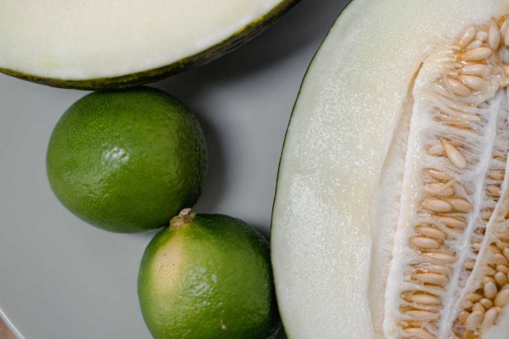

# What color should you choose? <!-- Quiz title -->

Find out what your interests tell about your color preferences! <!-- optional quiz description -->

# Questions

## What is 2 + 2? <!-- Question 1 -->

answer: B
explanation: It's basic math! <!-- optional answer explanation -->

### 2 <!-- Answer A -->

### 4 <!-- Answer B -->

### blah <!-- Answer C -->

### 0 <!-- Answer D -->

## What date did Marty McFly travel to in Back to the Future? <!-- Question 2 -->

answer: A

 <!-- optional image -->

### November 5, 1955

### March 20, 2048

### July 1, 1985

### September 22, 1966

## How many gigawatts? <!-- Question 3 -->

answer: C

### 5,000,000

### 3.8 X 10^30

### 1.21

### 5.36

# Results

## Good job!

score: 100% <!-- Minimum score to see this page -->

You can [add really cool links](https://www.onemoresteptravels.com/blog-homepage/prettiest-areas-in-maui-itinerary-luxury-resort) if you want.

## So close!

score: 75%

You can [add really cool links](https://www.onemoresteptravels.com/blog-homepage/prettiest-areas-in-maui-itinerary-luxury-resort) if you want.

## Keep Trying!

score: 0% <!-- optional, default min score is 0 -->

You can [add really cool links](https://www.onemoresteptravels.com/blog-homepage/prettiest-areas-in-maui-itinerary-luxury-resort) if you want.
